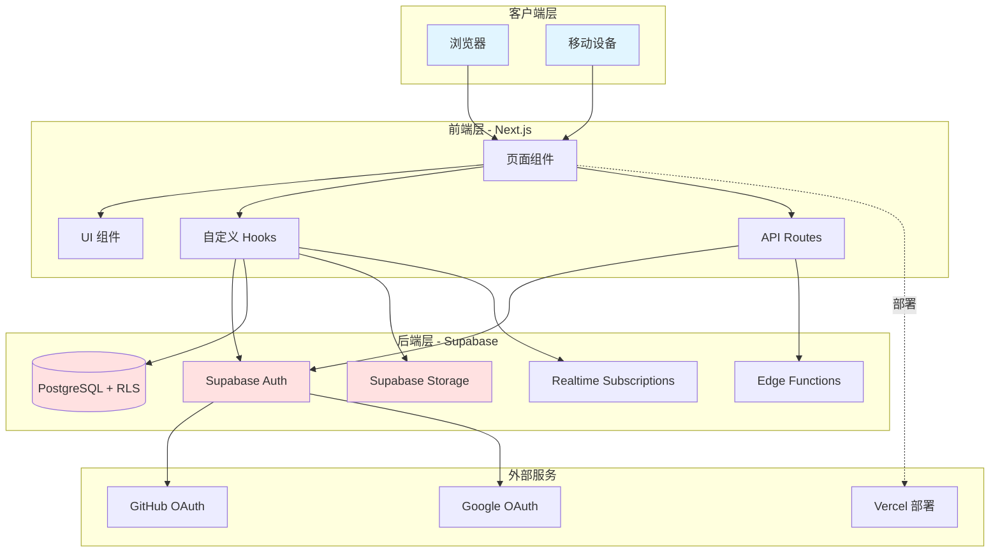

# 设计文档：Supabase 博客系统

## 概述

本设计文档描述了一个基于 Supabase 的现代化全栈博客系统的技术架构和实现细节。系统采用 Next.js 14 作为前端框架，使用 TypeScript 确保类型安全，Tailwind CSS 提供样式支持，Supabase 作为后端基础设施（包括 PostgreSQL 数据库、身份认证、文件存储和边缘函数）。

### 核心技术栈

- **前端框架**: Next.js 14 (App Router)
- **编程语言**: TypeScript 5.x
- **样式方案**: Tailwind CSS 3.x
- **后端服务**: Supabase (PostgreSQL + Auth + Storage + Edge Functions)
- **富文本编辑**: TipTap
- **部署平台**: Vercel (前端) + Supabase (后端)

### 设计原则

1. **类型安全**: 全面使用 TypeScript，为所有数据结构和 API 定义类型
2. **安全优先**: 使用 Supabase RLS (Row Level Security) 在数据库层面控制访问权限
3. **性能优化**: 利用 Next.js SSG/ISR 实现静态生成和增量更新
4. **响应式设计**: 支持桌面、平板和移动设备的自适应布局
5. **SEO 友好**: 服务端渲染和语义化 HTML 确保搜索引擎可索引性
6. **实时更新**: 使用 Supabase Realtime 实现数据的实时同步

## 架构

### 系统架构图



### 架构层次

#### 1. 客户端层
- 用户通过浏览器或移动设备访问应用
- 支持现代浏览器（Chrome、Firefox、Safari、Edge）
- 响应式设计适配不同屏幕尺寸

#### 2. 前端层 (Next.js)
- **页面路由**: 使用 App Router 实现文件系统路由
- **服务端渲染**: SSR/SSG 提供首屏性能和 SEO 优化
- **API Routes**: 处理服务端逻辑和 Supabase 交互
- **状态管理**: React Context + Hooks 管理全局状态
- **客户端缓存**: SWR 或 React Query 实现数据缓存和重新验证

#### 3. 后端层 (Supabase)
- **身份认证**: OAuth 2.0 集成（GitHub、Google）
- **数据库**: PostgreSQL 存储所有业务数据
- **行级安全**: RLS 策略控制数据访问权限
- **文件存储**: 存储用户头像、文章封面和媒体文件
- **实时订阅**: WebSocket 连接实现数据实时更新
- **边缘函数**: 处理复杂业务逻辑和后台任务

### 数据流

#### 认证流程
```
用户点击登录 → Next.js 页面 → Supabase Auth → OAuth 提供商 → 
回调处理 → 创建/更新 Profile → 设置 Session → 重定向到仪表盘
```

#### 文章发布流程
```
作者编辑文章 → 上传封面图片 → Storage → 保存文章数据 → 
应用 RLS 策略 → 写入 posts 表 → 触发 ISR 重新生成 → 
实时通知订阅者 → 更新前端显示
```

#### 评论提交流程
```
用户提交评论 → 验证认证状态 → 写入 comments 表 → 
设置状态为 pending → 实时通知管理员 → 管理员审核 → 
更新状态为 approved → 实时更新文章页面
```

## 组件和接口

### 核心模块

#### 1. 认证模块 (Auth Module)

**职责**: 处理用户认证、会话管理和权限验证

**接口**:
```typescript
interface AuthService {
  // 使用 OAuth 提供商登录
  signInWithOAuth(provider: 'github' | 'google'): Promise<AuthResponse>
  
  // 登出当前用户
  signOut(): Promise<void>
  
  // 获取当前用户会话
  getSession(): Promise<Session | null>
  
  // 获取当前用户资料
  getCurrentUser(): Promise<User | null>
  
  // 检查用户角色
  hasRole(role: UserRole): boolean
  
  // 刷新访问令牌
  refreshSession(): Promise<Session>
}

interface User {
  id: string
  email: string
  profile: UserProfile
}

interface UserProfile {
  id: string
  username: string
  avatar_url: string | null
  bio: string | null
  role: 'admin' | 'editor' | 'author'
  created_at: string
  updated_at: string
}

type AuthResponse = {
  user: User | null
  session: Session | null
  error: Error | null
}
```

**实现说明**:
- 使用 Supabase Auth SDK 的 `signInWithOAuth` 方法
- 会话存储在 HTTP-only cookies 中确保安全
- 使用 React Context 提供全局认证状态
- 实现自动令牌刷新机制


#### 2. 文章管理模块 (Post Module)

**职责**: 处理文章的 CRUD 操作、状态管理和搜索

**接口**:
```typescript
interface PostService {
  // 创建新文章
  createPost(data: CreatePostInput): Promise<Post>
  
  // 更新文章
  updatePost(id: string, data: UpdatePostInput): Promise<Post>
  
  // 删除文章
  deletePost(id: string): Promise<void>
  
  // 获取单篇文章（通过 ID）
  getPostById(id: string): Promise<Post | null>
  
  // 获取单篇文章（通过 slug）
  getPostBySlug(slug: string): Promise<Post | null>
  
  // 获取文章列表（带分页）
  getPosts(options: GetPostsOptions): Promise<PaginatedPosts>
  
  // 搜索文章
  searchPosts(query: string, options?: SearchOptions): Promise<Post[]>
  
  // 增加文章浏览量
  incrementViews(id: string): Promise<void>
  
  // 发布文章
  publishPost(id: string): Promise<Post>
  
  // 归档文章
  archivePost(id: string): Promise<Post>
}

interface Post {
  id: string
  title: string
  content: string
  excerpt: string | null
  slug: string
  status: 'draft' | 'published' | 'archived'
  author_id: string
  author?: UserProfile
  cover_image: string | null
  views: number
  published_at: string | null
  created_at: string
  updated_at: string
  categories?: Category[]
  tags?: Tag[]
  meta_title: string | null
  meta_description: string | null
}

interface CreatePostInput {
  title: string
  content: string
  excerpt?: string
  slug: string
  status?: 'draft' | 'published'
  cover_image?: string
  category_ids?: string[]
  tag_names?: string[]
  meta_title?: string
  meta_description?: string
}

interface UpdatePostInput extends Partial<CreatePostInput> {}

interface GetPostsOptions {
  page?: number
  limit?: number
  status?: 'draft' | 'published' | 'archived'
  author_id?: string
  category_id?: string
  tag_id?: string
  sort_by?: 'created_at' | 'published_at' | 'views'
  sort_order?: 'asc' | 'desc'
}

interface PaginatedPosts {
  data: Post[]
  total: number
  page: number
  limit: number
  total_pages: number
}

interface SearchOptions {
  limit?: number
  status?: 'published'
}
```

**实现说明**:
- 使用 Supabase 的 PostgreSQL 全文搜索功能
- slug 自动从标题生成（使用 slugify 库）
- excerpt 如果未提供则从 content 前 200 字符生成
- 发布时自动设置 published_at 时间戳
- 使用 RLS 策略确保作者只能修改自己的文章


#### 3. 分类和标签模块 (Category & Tag Module)

**职责**: 管理文章分类和标签系统

**接口**:
```typescript
interface CategoryService {
  // 创建分类
  createCategory(data: CreateCategoryInput): Promise<Category>
  
  // 更新分类
  updateCategory(id: string, data: UpdateCategoryInput): Promise<Category>
  
  // 删除分类
  deleteCategory(id: string): Promise<void>
  
  // 获取所有分类
  getCategories(): Promise<Category[]>
  
  // 获取单个分类
  getCategoryById(id: string): Promise<Category | null>
  
  // 获取分类下的文章
  getPostsByCategory(categoryId: string, options?: GetPostsOptions): Promise<PaginatedPosts>
}

interface TagService {
  // 创建标签
  createTag(name: string): Promise<Tag>
  
  // 删除标签
  deleteTag(id: string): Promise<void>
  
  // 获取所有标签
  getTags(): Promise<Tag[]>
  
  // 获取标签下的文章
  getPostsByTag(tagId: string, options?: GetPostsOptions): Promise<PaginatedPosts>
  
  // 为文章添加标签
  addTagsToPost(postId: string, tagNames: string[]): Promise<void>
  
  // 从文章移除标签
  removeTagsFromPost(postId: string, tagIds: string[]): Promise<void>
}

interface Category {
  id: string
  name: string
  slug: string
  description: string | null
  created_at: string
  updated_at: string
  post_count?: number
}

interface Tag {
  id: string
  name: string
  slug: string
  created_at: string
  post_count?: number
}

interface CreateCategoryInput {
  name: string
  slug: string
  description?: string
}

interface UpdateCategoryInput extends Partial<CreateCategoryInput> {}
```

**实现说明**:
- 分类和标签的 slug 必须唯一
- 删除分类前检查是否有关联文章
- 标签自动创建（如果不存在）
- 使用联结表 (post_categories, post_tags) 实现多对多关系

#### 4. 评论模块 (Comment Module)

**职责**: 处理评论的创建、审核和嵌套回复

**接口**:
```typescript
interface CommentService {
  // 创建评论
  createComment(data: CreateCommentInput): Promise<Comment>
  
  // 更新评论状态
  updateCommentStatus(id: string, status: CommentStatus): Promise<Comment>
  
  // 删除评论
  deleteComment(id: string): Promise<void>
  
  // 获取文章的评论
  getCommentsByPost(postId: string): Promise<Comment[]>
  
  // 获取待审核评论
  getPendingComments(): Promise<Comment[]>
  
  // 回复评论
  replyToComment(parentId: string, content: string): Promise<Comment>
}

interface Comment {
  id: string
  post_id: string
  user_id: string
  user?: UserProfile
  parent_id: string | null
  content: string
  status: 'pending' | 'approved' | 'spam'
  created_at: string
  updated_at: string
  replies?: Comment[]
}

interface CreateCommentInput {
  post_id: string
  content: string
  parent_id?: string
}

type CommentStatus = 'pending' | 'approved' | 'spam'
```

**实现说明**:
- 新评论默认状态为 'pending'
- 使用 parent_id 实现嵌套评论结构
- 仅显示状态为 'approved' 的评论给访客
- 使用递归查询构建评论树结构


#### 5. 存储模块 (Storage Module)

**职责**: 处理文件上传、删除和 URL 生成

**接口**:
```typescript
interface StorageService {
  // 上传文件
  uploadFile(file: File, bucket: StorageBucket, path?: string): Promise<UploadResult>
  
  // 删除文件
  deleteFile(bucket: StorageBucket, path: string): Promise<void>
  
  // 获取公开 URL
  getPublicUrl(bucket: StorageBucket, path: string): string
  
  // 获取签名 URL（私有文件）
  getSignedUrl(bucket: StorageBucket, path: string, expiresIn: number): Promise<string>
  
  // 列出用户的文件
  listUserFiles(userId: string, bucket: StorageBucket): Promise<StorageFile[]>
}

type StorageBucket = 'avatars' | 'covers' | 'media'

interface UploadResult {
  path: string
  url: string
  size: number
  type: string
}

interface StorageFile {
  name: string
  path: string
  size: number
  created_at: string
  url: string
}
```

**实现说明**:
- 文件路径格式: `{user_id}/{timestamp}_{filename}`
- 支持的图片格式: jpg, png, gif, webp
- 文件大小限制: 头像 5MB，其他 10MB
- 使用 Supabase Storage RLS 策略控制访问
- 自动生成缩略图（使用 Supabase Image Transformation）

#### 6. 实时订阅模块 (Realtime Module)

**职责**: 管理 WebSocket 连接和实时数据订阅

**接口**:
```typescript
interface RealtimeService {
  // 订阅文章更新
  subscribeToPost(postId: string, callback: (payload: RealtimePayload<Post>) => void): RealtimeSubscription
  
  // 订阅评论更新
  subscribeToComments(postId: string, callback: (payload: RealtimePayload<Comment>) => void): RealtimeSubscription
  
  // 订阅仪表盘统计
  subscribeToDashboard(callback: (payload: DashboardStats) => void): RealtimeSubscription
  
  // 取消订阅
  unsubscribe(subscription: RealtimeSubscription): void
}

interface RealtimePayload<T> {
  eventType: 'INSERT' | 'UPDATE' | 'DELETE'
  new: T | null
  old: T | null
  table: string
}

interface RealtimeSubscription {
  id: string
  unsubscribe: () => void
}

interface DashboardStats {
  total_posts: number
  total_comments: number
  total_users: number
  pending_comments: number
  recent_posts: Post[]
}
```

**实现说明**:
- 使用 Supabase Realtime 的 PostgreSQL Changes 功能
- 自动重连机制处理连接断开
- 订阅仅限于用户有权限访问的数据
- 在组件卸载时自动取消订阅


### UI 组件架构

#### 组件层次结构

```
app/
├── (auth)/
│   ├── login/
│   │   └── page.tsx          # 登录页面
│   └── callback/
│       └── route.ts           # OAuth 回调处理
├── (public)/
│   ├── page.tsx               # 首页（文章列表）
│   ├── posts/
│   │   └── [slug]/
│   │       └── page.tsx       # 文章详情页
│   ├── categories/
│   │   └── [slug]/
│   │       └── page.tsx       # 分类页面
│   └── tags/
│       └── [slug]/
│           └── page.tsx       # 标签页面
├── (dashboard)/
│   ├── dashboard/
│   │   ├── page.tsx           # 仪表盘首页
│   │   ├── posts/
│   │   │   ├── page.tsx       # 文章管理列表
│   │   │   ├── new/
│   │   │   │   └── page.tsx   # 新建文章
│   │   │   └── [id]/
│   │   │       └── edit/
│   │   │           └── page.tsx # 编辑文章
│   │   ├── media/
│   │   │   └── page.tsx       # 媒体库
│   │   ├── categories/
│   │   │   └── page.tsx       # 分类管理
│   │   ├── tags/
│   │   │   └── page.tsx       # 标签管理
│   │   ├── comments/
│   │   │   └── page.tsx       # 评论管理
│   │   └── settings/
│   │       └── page.tsx       # 系统设置
│   └── layout.tsx             # 仪表盘布局
└── api/
    ├── posts/
    │   └── route.ts           # 文章 API
    ├── comments/
    │   └── route.ts           # 评论 API
    └── upload/
        └── route.ts           # 文件上传 API
```

#### 核心 UI 组件

```typescript
// 布局组件
interface LayoutProps {
  children: React.ReactNode
}
- Header: 顶部导航栏
- Footer: 页脚
- Sidebar: 侧边栏（仪表盘）
- DashboardLayout: 仪表盘布局容器

// 文章组件
- PostCard: 文章卡片（列表展示）
- PostContent: 文章内容渲染
- PostEditor: 富文本编辑器（TipTap）
- PostMeta: 文章元信息（作者、日期、浏览量）
- PostList: 文章列表容器

// 评论组件
- CommentForm: 评论表单
- CommentItem: 单条评论
- CommentList: 评论列表（支持嵌套）
- CommentModeration: 评论审核界面

// 表单组件
- Input: 文本输入框
- Textarea: 多行文本框
- Select: 下拉选择
- FileUpload: 文件上传
- Button: 按钮
- Form: 表单容器（带验证）

// 通用组件
- Modal: 模态对话框
- Toast: 消息提示
- Loading: 加载指示器
- Pagination: 分页组件
- SearchBar: 搜索栏
- TagBadge: 标签徽章
- CategoryBadge: 分类徽章
```

## 数据模型

### 数据库架构

#### 1. profiles 表

存储用户配置信息，扩展 Supabase Auth 的用户数据。

```sql
CREATE TABLE profiles (
  id UUID PRIMARY KEY REFERENCES auth.users(id) ON DELETE CASCADE,
  username TEXT UNIQUE NOT NULL,
  avatar_url TEXT,
  bio TEXT,
  role TEXT NOT NULL DEFAULT 'author' CHECK (role IN ('admin', 'editor', 'author')),
  created_at TIMESTAMPTZ NOT NULL DEFAULT NOW(),
  updated_at TIMESTAMPTZ NOT NULL DEFAULT NOW()
);

-- 索引
CREATE INDEX idx_profiles_username ON profiles(username);
CREATE INDEX idx_profiles_role ON profiles(role);

-- 触发器：自动更新 updated_at
CREATE TRIGGER update_profiles_updated_at
  BEFORE UPDATE ON profiles
  FOR EACH ROW
  EXECUTE FUNCTION update_updated_at_column();
```

**字段说明**:
- `id`: 用户 ID，外键关联到 auth.users
- `username`: 用户名，唯一
- `avatar_url`: 头像 URL
- `bio`: 个人简介
- `role`: 用户角色（admin/editor/author）


#### 2. posts 表

存储博客文章的所有信息。

```sql
CREATE TABLE posts (
  id UUID PRIMARY KEY DEFAULT gen_random_uuid(),
  title TEXT NOT NULL CHECK (char_length(title) <= 200),
  content TEXT NOT NULL,
  excerpt TEXT,
  slug TEXT UNIQUE NOT NULL,
  status TEXT NOT NULL DEFAULT 'draft' CHECK (status IN ('draft', 'published', 'archived')),
  author_id UUID NOT NULL REFERENCES profiles(id) ON DELETE CASCADE,
  cover_image TEXT,
  views INTEGER NOT NULL DEFAULT 0,
  meta_title TEXT,
  meta_description TEXT,
  published_at TIMESTAMPTZ,
  created_at TIMESTAMPTZ NOT NULL DEFAULT NOW(),
  updated_at TIMESTAMPTZ NOT NULL DEFAULT NOW()
);

-- 索引
CREATE INDEX idx_posts_author_id ON posts(author_id);
CREATE INDEX idx_posts_status ON posts(status);
CREATE INDEX idx_posts_slug ON posts(slug);
CREATE INDEX idx_posts_published_at ON posts(published_at DESC);
CREATE INDEX idx_posts_views ON posts(views DESC);

-- 全文搜索索引
CREATE INDEX idx_posts_search ON posts USING gin(to_tsvector('chinese', title || ' ' || content));

-- 触发器
CREATE TRIGGER update_posts_updated_at
  BEFORE UPDATE ON posts
  FOR EACH ROW
  EXECUTE FUNCTION update_updated_at_column();
```

**字段说明**:
- `id`: 文章唯一标识
- `title`: 文章标题（最大 200 字符）
- `content`: 文章内容（富文本 HTML）
- `excerpt`: 文章摘要
- `slug`: URL 友好的标识符（唯一）
- `status`: 文章状态（draft/published/archived）
- `author_id`: 作者 ID
- `cover_image`: 封面图片 URL
- `views`: 浏览量计数
- `meta_title`: SEO 标题
- `meta_description`: SEO 描述
- `published_at`: 发布时间
- `created_at`: 创建时间
- `updated_at`: 更新时间

#### 3. categories 表

存储文章分类。

```sql
CREATE TABLE categories (
  id UUID PRIMARY KEY DEFAULT gen_random_uuid(),
  name TEXT UNIQUE NOT NULL,
  slug TEXT UNIQUE NOT NULL,
  description TEXT,
  created_at TIMESTAMPTZ NOT NULL DEFAULT NOW(),
  updated_at TIMESTAMPTZ NOT NULL DEFAULT NOW()
);

-- 索引
CREATE INDEX idx_categories_slug ON categories(slug);

-- 触发器
CREATE TRIGGER update_categories_updated_at
  BEFORE UPDATE ON categories
  FOR EACH ROW
  EXECUTE FUNCTION update_updated_at_column();
```

**字段说明**:
- `id`: 分类唯一标识
- `name`: 分类名称（唯一）
- `slug`: URL 友好标识符（唯一）
- `description`: 分类描述

#### 4. tags 表

存储文章标签。

```sql
CREATE TABLE tags (
  id UUID PRIMARY KEY DEFAULT gen_random_uuid(),
  name TEXT UNIQUE NOT NULL,
  slug TEXT UNIQUE NOT NULL,
  created_at TIMESTAMPTZ NOT NULL DEFAULT NOW()
);

-- 索引
CREATE INDEX idx_tags_slug ON tags(slug);
CREATE INDEX idx_tags_name ON tags(name);
```

**字段说明**:
- `id`: 标签唯一标识
- `name`: 标签名称（唯一）
- `slug`: URL 友好标识符（唯一）

#### 5. post_categories 表

文章和分类的多对多关联表。

```sql
CREATE TABLE post_categories (
  post_id UUID NOT NULL REFERENCES posts(id) ON DELETE CASCADE,
  category_id UUID NOT NULL REFERENCES categories(id) ON DELETE CASCADE,
  created_at TIMESTAMPTZ NOT NULL DEFAULT NOW(),
  PRIMARY KEY (post_id, category_id)
);

-- 索引
CREATE INDEX idx_post_categories_post_id ON post_categories(post_id);
CREATE INDEX idx_post_categories_category_id ON post_categories(category_id);
```

#### 6. post_tags 表

文章和标签的多对多关联表。

```sql
CREATE TABLE post_tags (
  post_id UUID NOT NULL REFERENCES posts(id) ON DELETE CASCADE,
  tag_id UUID NOT NULL REFERENCES tags(id) ON DELETE CASCADE,
  created_at TIMESTAMPTZ NOT NULL DEFAULT NOW(),
  PRIMARY KEY (post_id, tag_id)
);

-- 索引
CREATE INDEX idx_post_tags_post_id ON post_tags(post_id);
CREATE INDEX idx_post_tags_tag_id ON post_tags(tag_id);
```


#### 7. comments 表

存储文章评论，支持嵌套回复。

```sql
CREATE TABLE comments (
  id UUID PRIMARY KEY DEFAULT gen_random_uuid(),
  post_id UUID NOT NULL REFERENCES posts(id) ON DELETE CASCADE,
  user_id UUID NOT NULL REFERENCES profiles(id) ON DELETE CASCADE,
  parent_id UUID REFERENCES comments(id) ON DELETE CASCADE,
  content TEXT NOT NULL,
  status TEXT NOT NULL DEFAULT 'pending' CHECK (status IN ('pending', 'approved', 'spam')),
  created_at TIMESTAMPTZ NOT NULL DEFAULT NOW(),
  updated_at TIMESTAMPTZ NOT NULL DEFAULT NOW()
);

-- 索引
CREATE INDEX idx_comments_post_id ON comments(post_id);
CREATE INDEX idx_comments_user_id ON comments(user_id);
CREATE INDEX idx_comments_parent_id ON comments(parent_id);
CREATE INDEX idx_comments_status ON comments(status);
CREATE INDEX idx_comments_created_at ON comments(created_at DESC);

-- 触发器
CREATE TRIGGER update_comments_updated_at
  BEFORE UPDATE ON comments
  FOR EACH ROW
  EXECUTE FUNCTION update_updated_at_column();
```

**字段说明**:
- `id`: 评论唯一标识
- `post_id`: 关联的文章 ID
- `user_id`: 评论者 ID
- `parent_id`: 父评论 ID（用于嵌套回复）
- `content`: 评论内容
- `status`: 评论状态（pending/approved/spam）
- `created_at`: 创建时间
- `updated_at`: 更新时间

#### 8. settings 表

存储系统配置。

```sql
CREATE TABLE settings (
  key TEXT PRIMARY KEY,
  value JSONB NOT NULL,
  description TEXT,
  created_at TIMESTAMPTZ NOT NULL DEFAULT NOW(),
  updated_at TIMESTAMPTZ NOT NULL DEFAULT NOW()
);

-- 触发器
CREATE TRIGGER update_settings_updated_at
  BEFORE UPDATE ON settings
  FOR EACH ROW
  EXECUTE FUNCTION update_updated_at_column();

-- 初始化默认设置
INSERT INTO settings (key, value, description) VALUES
  ('site_title', '"我的博客"', '网站标题'),
  ('site_subtitle', '"分享技术与生活"', '网站副标题'),
  ('site_description', '"一个基于 Supabase 的现代化博客系统"', '网站描述'),
  ('posts_per_page', '10', '每页显示文章数'),
  ('comment_moderation', 'true', '评论是否需要审核'),
  ('max_upload_size', '10485760', '最大上传文件大小（字节）'),
  ('allowed_file_types', '["jpg","png","gif","webp"]', '允许的文件类型');
```

**字段说明**:
- `key`: 设置键（唯一）
- `value`: 设置值（JSONB 格式）
- `description`: 设置描述

### 数据库函数

#### update_updated_at_column()

自动更新 updated_at 字段的触发器函数。

```sql
CREATE OR REPLACE FUNCTION update_updated_at_column()
RETURNS TRIGGER AS $$
BEGIN
  NEW.updated_at = NOW();
  RETURN NEW;
END;
$$ LANGUAGE plpgsql;
```

#### increment_post_views()

增加文章浏览量的函数。

```sql
CREATE OR REPLACE FUNCTION increment_post_views(post_id UUID)
RETURNS void AS $$
BEGIN
  UPDATE posts
  SET views = views + 1
  WHERE id = post_id;
END;
$$ LANGUAGE plpgsql SECURITY DEFINER;
```

### 行级安全策略 (RLS)

#### profiles 表 RLS

```sql
-- 启用 RLS
ALTER TABLE profiles ENABLE ROW LEVEL SECURITY;

-- 所有人可以查看用户资料
CREATE POLICY "Public profiles are viewable by everyone"
  ON profiles FOR SELECT
  USING (true);

-- 用户可以更新自己的资料
CREATE POLICY "Users can update own profile"
  ON profiles FOR UPDATE
  USING (auth.uid() = id);

-- 用户可以插入自己的资料
CREATE POLICY "Users can insert own profile"
  ON profiles FOR INSERT
  WITH CHECK (auth.uid() = id);
```


#### posts 表 RLS

```sql
-- 启用 RLS
ALTER TABLE posts ENABLE ROW LEVEL SECURITY;

-- 辅助函数：获取用户角色
CREATE OR REPLACE FUNCTION get_user_role()
RETURNS TEXT AS $$
  SELECT role FROM profiles WHERE id = auth.uid();
$$ LANGUAGE sql SECURITY DEFINER;

-- 所有人可以查看已发布的文章
CREATE POLICY "Published posts are viewable by everyone"
  ON posts FOR SELECT
  USING (status = 'published');

-- 作者可以查看自己的所有文章
CREATE POLICY "Authors can view own posts"
  ON posts FOR SELECT
  USING (auth.uid() = author_id);

-- 编辑和管理员可以查看所有文章
CREATE POLICY "Editors and admins can view all posts"
  ON posts FOR SELECT
  USING (get_user_role() IN ('editor', 'admin'));

-- 认证用户可以创建文章
CREATE POLICY "Authenticated users can create posts"
  ON posts FOR INSERT
  WITH CHECK (auth.uid() = author_id);

-- 作者可以更新自己的文章
CREATE POLICY "Authors can update own posts"
  ON posts FOR UPDATE
  USING (auth.uid() = author_id);

-- 编辑和管理员可以更新所有文章
CREATE POLICY "Editors and admins can update all posts"
  ON posts FOR UPDATE
  USING (get_user_role() IN ('editor', 'admin'));

-- 作者可以删除自己的文章
CREATE POLICY "Authors can delete own posts"
  ON posts FOR DELETE
  USING (auth.uid() = author_id);

-- 管理员可以删除所有文章
CREATE POLICY "Admins can delete all posts"
  ON posts FOR DELETE
  USING (get_user_role() = 'admin');
```

#### categories 表 RLS

```sql
-- 启用 RLS
ALTER TABLE categories ENABLE ROW LEVEL SECURITY;

-- 所有人可以查看分类
CREATE POLICY "Categories are viewable by everyone"
  ON categories FOR SELECT
  USING (true);

-- 管理员可以管理分类
CREATE POLICY "Admins can manage categories"
  ON categories FOR ALL
  USING (get_user_role() = 'admin');
```

#### tags 表 RLS

```sql
-- 启用 RLS
ALTER TABLE tags ENABLE ROW LEVEL SECURITY;

-- 所有人可以查看标签
CREATE POLICY "Tags are viewable by everyone"
  ON tags FOR SELECT
  USING (true);

-- 认证用户可以创建标签
CREATE POLICY "Authenticated users can create tags"
  ON tags FOR INSERT
  WITH CHECK (auth.uid() IS NOT NULL);

-- 管理员可以删除标签
CREATE POLICY "Admins can delete tags"
  ON tags FOR DELETE
  USING (get_user_role() = 'admin');
```

#### post_categories 和 post_tags 表 RLS

```sql
-- 启用 RLS
ALTER TABLE post_categories ENABLE ROW LEVEL SECURITY;
ALTER TABLE post_tags ENABLE ROW LEVEL SECURITY;

-- 所有人可以查看关联
CREATE POLICY "Post associations are viewable by everyone"
  ON post_categories FOR SELECT
  USING (true);

CREATE POLICY "Post tag associations are viewable by everyone"
  ON post_tags FOR SELECT
  USING (true);

-- 文章作者可以管理自己文章的关联
CREATE POLICY "Authors can manage own post categories"
  ON post_categories FOR ALL
  USING (
    EXISTS (
      SELECT 1 FROM posts
      WHERE posts.id = post_categories.post_id
      AND posts.author_id = auth.uid()
    )
  );

CREATE POLICY "Authors can manage own post tags"
  ON post_tags FOR ALL
  USING (
    EXISTS (
      SELECT 1 FROM posts
      WHERE posts.id = post_tags.post_id
      AND posts.author_id = auth.uid()
    )
  );

-- 编辑和管理员可以管理所有关联
CREATE POLICY "Editors and admins can manage all post categories"
  ON post_categories FOR ALL
  USING (get_user_role() IN ('editor', 'admin'));

CREATE POLICY "Editors and admins can manage all post tags"
  ON post_tags FOR ALL
  USING (get_user_role() IN ('editor', 'admin'));
```

#### comments 表 RLS

```sql
-- 启用 RLS
ALTER TABLE comments ENABLE ROW LEVEL SECURITY;

-- 所有人可以查看已批准的评论
CREATE POLICY "Approved comments are viewable by everyone"
  ON comments FOR SELECT
  USING (status = 'approved');

-- 用户可以查看自己的所有评论
CREATE POLICY "Users can view own comments"
  ON comments FOR SELECT
  USING (auth.uid() = user_id);

-- 编辑和管理员可以查看所有评论
CREATE POLICY "Editors and admins can view all comments"
  ON comments FOR SELECT
  USING (get_user_role() IN ('editor', 'admin'));

-- 认证用户可以创建评论
CREATE POLICY "Authenticated users can create comments"
  ON comments FOR INSERT
  WITH CHECK (auth.uid() = user_id);

-- 用户可以删除自己的评论
CREATE POLICY "Users can delete own comments"
  ON comments FOR DELETE
  USING (auth.uid() = user_id);

-- 编辑和管理员可以更新和删除所有评论
CREATE POLICY "Editors and admins can manage all comments"
  ON comments FOR ALL
  USING (get_user_role() IN ('editor', 'admin'));
```

#### settings 表 RLS

```sql
-- 启用 RLS
ALTER TABLE settings ENABLE ROW LEVEL SECURITY;

-- 所有人可以查看设置
CREATE POLICY "Settings are viewable by everyone"
  ON settings FOR SELECT
  USING (true);

-- 管理员可以管理设置
CREATE POLICY "Admins can manage settings"
  ON settings FOR ALL
  USING (get_user_role() = 'admin');
```

### Storage 桶配置

#### avatars 桶

存储用户头像。

```sql
-- 创建桶
INSERT INTO storage.buckets (id, name, public)
VALUES ('avatars', 'avatars', true);

-- RLS 策略
CREATE POLICY "Avatar images are publicly accessible"
  ON storage.objects FOR SELECT
  USING (bucket_id = 'avatars');

CREATE POLICY "Users can upload own avatar"
  ON storage.objects FOR INSERT
  WITH CHECK (
    bucket_id = 'avatars'
    AND auth.uid()::text = (storage.foldername(name))[1]
  );

CREATE POLICY "Users can update own avatar"
  ON storage.objects FOR UPDATE
  USING (
    bucket_id = 'avatars'
    AND auth.uid()::text = (storage.foldername(name))[1]
  );

CREATE POLICY "Users can delete own avatar"
  ON storage.objects FOR DELETE
  USING (
    bucket_id = 'avatars'
    AND auth.uid()::text = (storage.foldername(name))[1]
  );
```

#### covers 桶

存储文章封面图片。

```sql
-- 创建桶
INSERT INTO storage.buckets (id, name, public)
VALUES ('covers', 'covers', true);

-- RLS 策略（类似 avatars）
CREATE POLICY "Cover images are publicly accessible"
  ON storage.objects FOR SELECT
  USING (bucket_id = 'covers');

CREATE POLICY "Authenticated users can upload covers"
  ON storage.objects FOR INSERT
  WITH CHECK (
    bucket_id = 'covers'
    AND auth.uid() IS NOT NULL
  );
```

#### media 桶

存储文章中的媒体文件。

```sql
-- 创建桶
INSERT INTO storage.buckets (id, name, public)
VALUES ('media', 'media', true);

-- RLS 策略（类似 covers）
CREATE POLICY "Media files are publicly accessible"
  ON storage.objects FOR SELECT
  USING (bucket_id = 'media');

CREATE POLICY "Authenticated users can upload media"
  ON storage.objects FOR INSERT
  WITH CHECK (
    bucket_id = 'media'
    AND auth.uid() IS NOT NULL
  );
```

